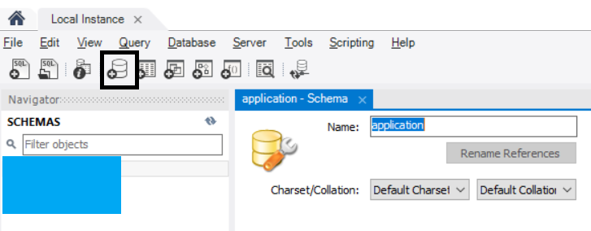
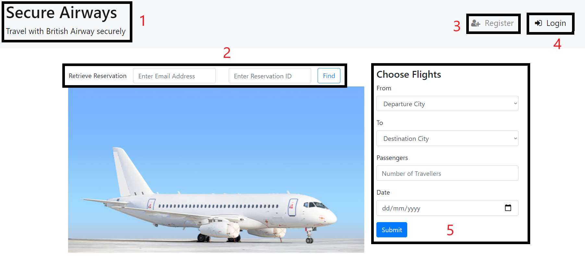
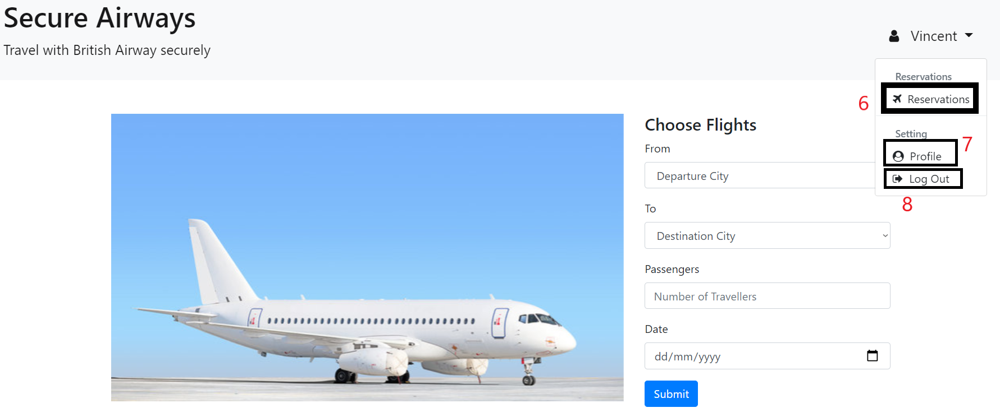
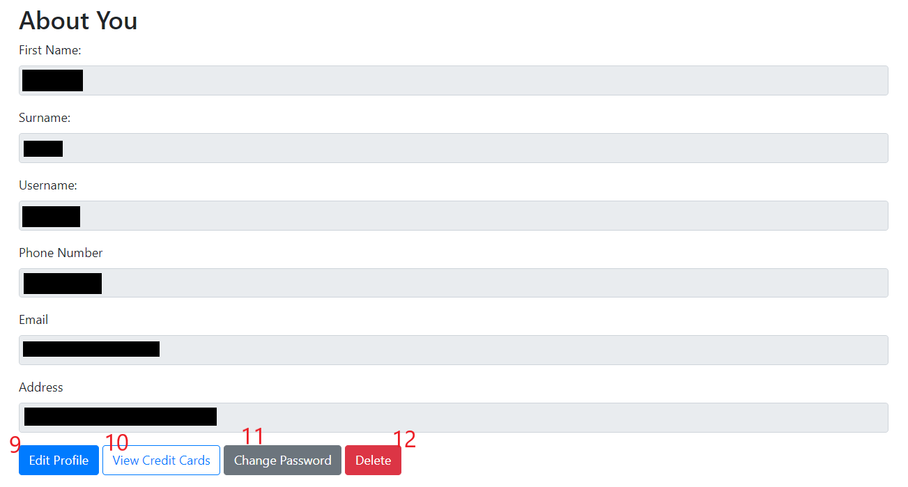
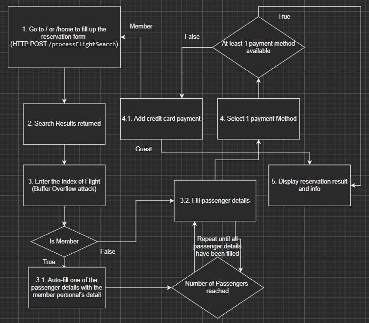

# inSecurity

This is the Flight Reservation Web Application repository for UCD BSc Computer Science module [COMP47660](https://sisweb.ucd.ie/usis/!W_HU_MENU.P_PUBLISH?p_tag=MODULE&MODULE=COMP47660) Secure Software Engineering

## Pre-requisites

- Java 8 or higher version (version 1.8+)
- Maven
- MySQL server

## How to run this program

1. Create a database schema on your MySQL server. let say `application`

    - With `MySQL Workbench` :

        

    - With `MySQL Shell` :

        ```SQL
        CREATE SCHEMA IF NOT EXISTS `application`; -- application : <schema_name>
        ```

2. Go to `<project_root_directory>/src/main/resources/application.properties` to configure the application connection with your server credential :

    ```properties
    # schema_name=`application` by default
    spring.datasource.url=jdbc:mysql://localhost:3306/application?createDatabaseIfNotExist=true
    spring.datasource.username=ENC(<your_encoded_username>)
    spring.datasource.password=ENC(<your_encoded_password>)
    ```

    (**Note** : *Make sure the user account of credential given used has the privilege to modify the schema*)

   - Encryption of sensitive properties inside file application.properties is enabled with [Jasypt](http://www.jasypt.org)
   - To generate the encoded credential value, go to maven library path ` ~/.m2/repository/org/jasypt/jasypt/1.9.0` on terminal (CLI)
   - Use the following commmand to run the JAR program to generate the encoded value
     ```
      java -cp jasypt-1.9.0.jar org.jasypt.intf.cli.JasyptPBEStringEncryptionCLI input="value" password=<key> algorithm=PBEWithMD5AndDES
     ```
      - __input__ - The value in string to be encoded
      - __password__ - The key for both encryption and decryption of the input
      - __algorithm__ - The encoding algorithm, that here we use a Password-Based version of DES Encryption algorithm, with the MD5 hash of the password as the encryption key
   - Jasypt reads all the properties from _application.properties_ or any classpath properties that you passed, with value prefix __ENC(__ and suffix __)__
   - The password is required to run this application, with the following Maven argument :
     
     `-Djasypt.encryptor.password=<key>`
     
   - Reference : <https://medium.com/@mail2rajeevshukla/hiding-encrypting-database-password-in-the-application-properties-34d59fe104eb>
   
3. Open a terminal on the root directory of this project (ie. where this doc is stored)
4. Run the command `mvn clean install` to run tests and build the project
5. Run the command `mvn spring-boot:run` to run the Spring Boot application
6. **Note** that the first run of this web app will return certain `Exception` since initialization of database tables is not included in the relevant SQL script, while *those tables will be initialized automatically after those exceptions are thrown*. Thus, it will run smoothly after the first time.
7. Go to `http://localhost:<server.port>` to open the web application (setting can be done in `application.properties`)

    ```properties
    # 8080 by default
    server.port=<open_port>
    ```

## Introduction to this web application

Homepage is the first page you will always see when you open this application with `localhost:<server.port>`



1. Header of the navigation bar, also the link to homepage
2. Reservation retrieval form for any `guest` with their email address & reservation id
3. Club member registration link
4. Member login link
5. Flight search as a guest

### Member

1. Register a **Club Member Account** by clicking the `Register` link (3) in the upper right-hand corner.
2. Input the required details and click `Register` at the bottom of the form.
3. Upon returning to the login page, you can login as the created Member via the `Login` button (4) in the upper-right hand side of the page.

    

4. Clicking on the Member icon (displayed as your *username*) that has nor replaced the Register/Login icons, a dropdown menu will give you a choice of viewing reservations (6), your profile (7) or logging out (8).
5. Click on Profile to see your personal details and find links to edit user details (9), view stored credit cards (10), changing password (11), or delete the Member registration (12).

    

6. By default, credit cards are required to book a flight. Select `View Credit cards`, then `Add New Card` to create one. If you do not you will be propmpted to do so during the boooking process.
7. From the home page, select a Fight to book. An example might be From Sofia to Dublin on the 19th of March.
8. After completing a booking it will be available to view in `Reservations` in the Member drop-down menu in the upper-right hand side.
9. If more than 24 hours away, an option to cancel will be available.

### Guest

1. As a guest, you can use the flight search form (5) right away to make reservation
2. You will require the `email address` and the `reservation id` to retrieve your reservation information

#### General Reservation Workflow



#### Authors (Team inSecurity)

- [Ee En Goh](https://github.com/GohEeEn)
- [Seán Conor McLoughlin](https://github.com/SeanConor)
- [Olanipekun Akintola](https://github.com/olaakintola)
- [Svetoslav Nizhnichenkov](https://github.com/nizhnichenkov)
